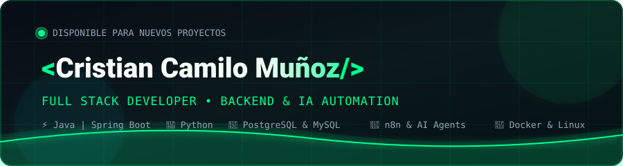

<div align="center">
  <!-- BANNER SVG PROPIO (100% Estable, sin caídas externas) -->
  
  <br/><br/>
  <!-- EFECTO TYPING ANIMADO -->
  <a href="https://cristixn04.github.io" target="_blank">
    
  </a>
  <br/><br/>
  <!-- BADGES DE CONTACTO -->
  <a href="https://cristixn04.github.io" target="_blank">
    
  </a>
  &nbsp;
  <a href="https://www.linkedin.com/in/cristian-muñoz-159980409" target="_blank">
    
  </a>
  &nbsp;
  <a href="mailto:7b.munoz.cristian@gmail.com">
    
  </a>
</div>

---

### 👨‍💻 Sobre mí

```yaml
nombre: Cristian Camilo Muñoz Rodríguez
rol: Full Stack & Backend Developer
enfoque: Arquitectura Backend, Bases de Datos Relacionales, Automatización & IA
ubicacion: Colombia
disponibilidad: Open to Work & Proyectos Colaborativos 🚀
filosofia: "Construir soluciones de software robustas, eficientes y que generen impacto real."
```

- 💡 **Especialidad:** Desarrollo backend con **Java (Spring Boot)**, **Python** y diseño de APIs RESTful.
- 🗄️ **Bases de Datos:** Modelado y optimización con **PostgreSQL**, **MySQL** y **MariaDB**.
- 🤖 **IA & Automatización:** Creación de flujos de trabajo con **n8n**, integración de LLMs y agentes inteligentes.
- 🖥️ **Sistemas & Entorno:** Experiencia en entornos **Linux** y despliegues con **Docker**.

---

### 🛠️ Stack Tecnológico

<div align="center">
  
</div>

<br/>

<details open>
<summary><b>📂 Desglose por áreas</b></summary>
<br/>

| Área | Tecnologías & Herramientas |
| :--- | :--- |
| **Backend & Core** | `Java` `Spring Boot` `Python` `Node.js` `REST APIs` `JavaFX` |
| **Bases de Datos** | `PostgreSQL` `MySQL` `MariaDB` `Modelado Relacional` |
| **IA & Automatización** | `n8n Workflows` `Agentes IA` `Integración LLMs` `Webhooks` |
| **Frontend** | `JavaScript (ES6+)` `HTML5` `CSS3` `Responsive Design` |
| **Herramientas & DevOps**| `Docker` `Linux / Bash` `Git` `GitHub` `Postman` `VS Code` `STS4` |

</details>

---

### 🚀 Proyectos Destacados

<table>
  <tr>
    <td width="50%">
      <h3 align="center">🛡️ SICA-ACME</h3>
      <p align="center">
        <b>Control de Acceso y Gestión de Seguridad</b><br/>
        Software de escritorio con arquitectura robusta, máquina de estados para flujo de visitas y auditoría inmutable en tiempo real.
      </p>
      <p align="center">
        <code>Java</code> • <code>JavaFX</code> • <code>PostgreSQL</code> • <code>FXML</code>
      </p>
      <p align="center">
        <a href="https://github.com/Cristixn04/SICA-ACME"><b>Ver Repositorio →</b></a>
      </p>
    </td>
    <td width="50%">
      <h3 align="center">💳 ACME Bank</h3>
      <p align="center">
        <b>Simulador y Plataforma Bancaria Web</b><br/>
        Interfaz bancaria interactiva con autenticación de usuarios, consulta de movimientos, retiros, consignaciones y pago de servicios.
      </p>
      <p align="center">
        <code>JavaScript</code> • <code>HTML5</code> • <code>CSS3</code>
      </p>
      <p align="center">
        <a href="https://cristixn04.github.io/ACME-BANK-PROYECT/"><b>Demo en Vivo</b></a> • 
        <a href="https://github.com/Cristixn04/ACME-BANK-PROYECT"><b>Repositorio →</b></a>
      </p>
    </td>
  </tr>
  <tr>
    <td width="50%">
      <h3 align="center">📊 Gestión de Notas</h3>
      <p align="center">
        <b>Herramienta de Calificaciones Académicas</b><br/>
        Sistema web para registro y procesamiento de notas académicas, cálculo automático de promedios ponderados y ranking de estudiantes.
      </p>
      <p align="center">
        <code>JavaScript</code> • <code>HTML5</code> • <code>CSS3</code>
      </p>
      <p align="center">
        <a href="https://cristixn04.github.io/Pagina-de-gestion-de-notas/"><b>Demo en Vivo</b></a> • 
        <a href="https://github.com/Cristixn04/Pagina-de-gestion-de-notas"><b>Repositorio →</b></a>
      </p>
    </td>
    <td width="50%">
      <h3 align="center">🛍️ Ecommerce Ropa</h3>
      <p align="center">
        <b>Tienda Virtual & Carrito de Compras</b><br/>
        Plataforma e-commerce con catálogo de prendas, filtrado de productos y flujo intuitivo de carrito y checkout.
      </p>
      <p align="center">
        <code>JavaScript</code> • <code>HTML5</code> • <code>CSS3</code>
      </p>
      <p align="center">
        <a href="https://github.com/TuMinipeka/Proyecto-Ecommerce-Ropa"><b>Ver Repositorio →</b></a>
      </p>
    </td>
  </tr>
</table>

---

### 📈 Métricas de GitHub

<div align="center">
  
  
</div>

<div align="center" style="margin-top: 10px;">
  
</div>

---

### 🌐 Conéctate Conmigo

<div align="center">
  <a href="https://www.linkedin.com/in/cristian-muñoz-159980409" target="_blank">
    
  </a>
  &nbsp;
  <a href="https://cristixn04.github.io" target="_blank">
    
  </a>
  &nbsp;
  <a href="mailto:7b.munoz.cristian@gmail.com">
    
  </a>
  &nbsp;
  <a href="https://github.com/Cristixn04">
    
  </a>
</div>

<br/>

<div align="center">
  
</div>

